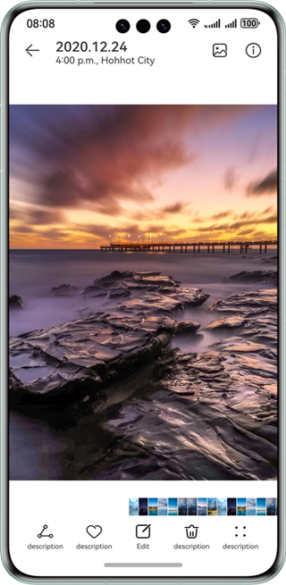
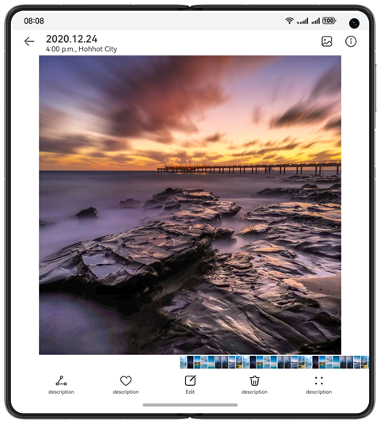
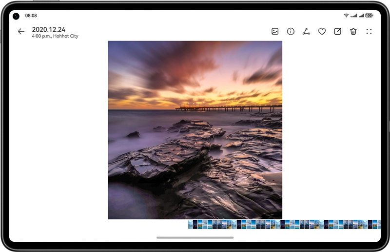

# Image Beautification

## Introduction

Learn to implement an image beautification app based on the adaptive layout and responsive layout, achieving one-time development for multi-device deployment.

## Description

This codelab implements an image beautification app based on the adaptive layout and responsive layout, achieving one-time development for multi-device deployment. It uses the three-layer project architecture for code reuse and tailors the pages to different device sizes such as Bar phone, Bi-fold phone, Tablet devices.
The following figure shows the effect on the Bar phone.



The following figure shows the effect on the Bi-fold phone in unfolded state.



The following figure shows the effect of the Tablet device.



## Project Directory
```
├──commons                                     // Common capability layer
│  ├──base/src/main/ets                        // Basic capabilities
│  │  ├──constants                             // Constants
│  │  └──utils                                 // Constants
│  ├──base/src/main/resources                  // Directory of resource files
│  └──base/Index.ets                           // External interfaces
├──features                                    // Basic feature layer
│  ├──albumView/src/main/ets                   // Album
│  │  ├──constants
│  │  │  └──AlbumViewConstants.ets             // Constants        
│  │  └──view
│  │     ├──AlbumView.ets                      // Album page
│  │     └──SideColumn.ets                     // Side bar
│  ├──albumView/src/main/resources             // Directory of resource files
│  ├──albumView/Index.ets                      // External interfaces
│  ├──pictureEdit/src/main/ets                 // Image editing
│  │  ├──constants
│  │  │  └──PictureEditConstants.ets           // Constants
│  │  ├──viewmodel 
│  │  │  └──AdaptiveViewModel.ets              // Adaptive layout
│  │  └──views
│  │      └──PictureEdit.ets                   // Image editing home page
│  ├──pictureEdit/src/main/resources           // Directory of resource files
│  └──pictureEdit/Index.ets                    // External interfaces
│  ├──pictureView/src/main/ets                 // Large image preview
│  │  ├──constants
│  │  │  └──PictureViewConstants.ets           // Constants
│  │  ├──pages
│  │  │  └──PictureViewIndex.ets               // Large image preview page
│  │  ├──view
│  │  │  ├──BottomBar.ets                      // Bottom bar
│  │  │  ├──CenterPart.ets                     // Large image in the center
│  │  │  ├──PreviewLists.ets                   // Thumbnail of the image sliding at the bottom
│  │  │  └──TopBar.ets                         // Top bar
│  │  └──viewmodel
│  │     └──AdaptiveViewModel.ets              // Adaptive layout
│  ├──pictureView/src/main/resources           // Directory of resource files
│  └──pictureView/src/Index.ets                // External interfaces
└──products                                    // Product customization layer
   ├──phone/src/main/ets                       
   │  ├──pages 
   │  │  └──Index.ets                          // Main page
   │  └──phoneability
   │     └──PhoneAbility.ets                   // Application entry
   └──phone/src/main/resources                 // Directory of resource files
```

## Concepts

- One-time development for multi-device deployment: It enables you to develop and release one set of project code for deployment on multiple devices as demanded. This feature enables you to efficiently develop applications that are compatible with multiple devices while providing distributed user experiences for cross-device transferring, migration, and collaboration.
- Area change event: It is triggered when the component's size, position, or any other attribute that may affect its display area changes.
- PinchGesture: It is used to trigger a pinch gesture, which requires two to five fingers with a minimum 5 vp distance between the fingers.

## Permissions

N/A.

## How to Use

- Install and open an app on a Bar phone, Bi-fold phone, Tablet device. The responsive layout and adaptive layout are used to display different effects on the app pages over different devices.
- Tap the edit or album icon to access the photo editing page or album page.

## Constraints

1. The sample is only supported on Bar phones, Bi-fold phone (Mate X series), Tablet device with standard systems.
2. HarmonyOS: HarmonyOS 5.0.5 Release or later.
3. DevEco Studio: DevEco Studio 6.0.2 Release or later.
4. HarmonyOS SDK: HarmonyOS 6.0.2 Release SDK or later.
