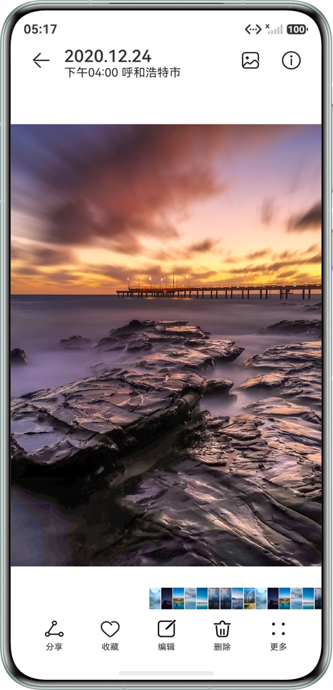
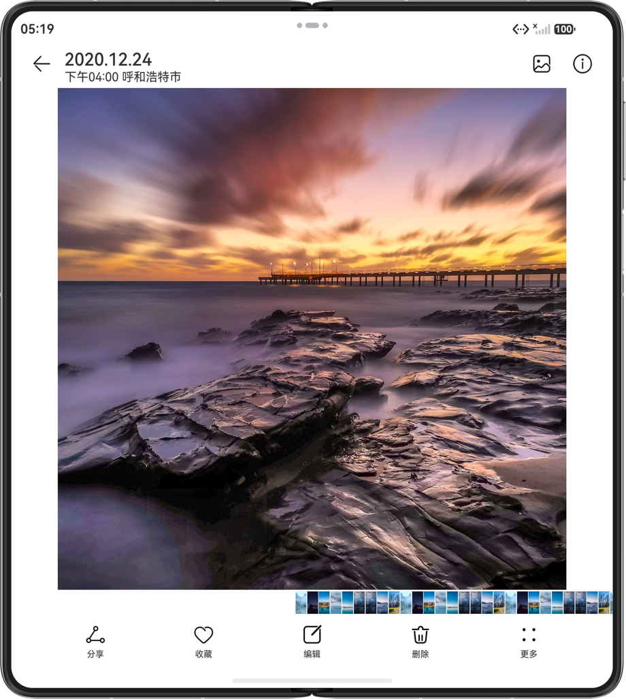
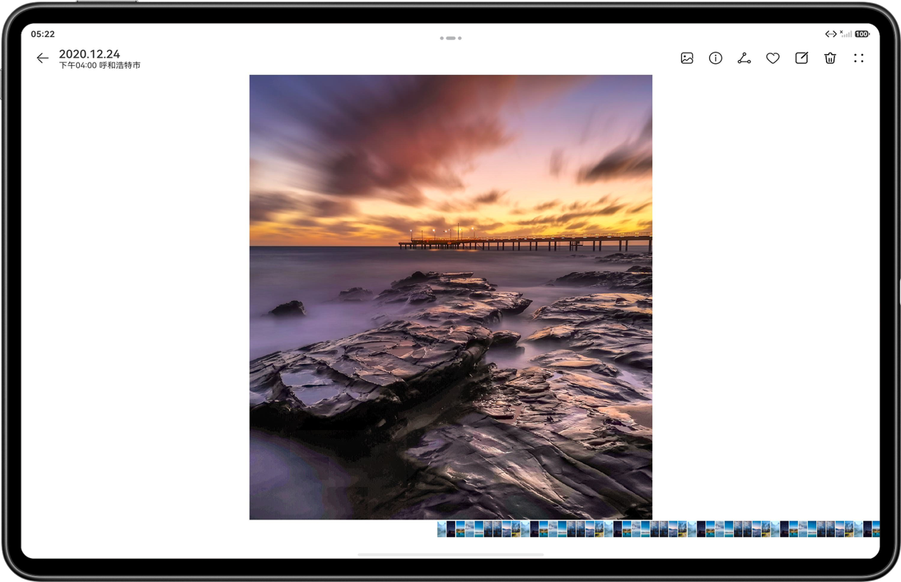

# 多设备图片美化界面

## 项目简介

基于自适应和响应式布局，实现一次开发，多端部署-图片美化。

## 效果预览

本篇Codelab基于自适应布局和响应式布局，实现一次开发，多端部署的即时通讯页面。通过“三层工程架构”实现代码复用，并根据直板机、装折叠、平板不同的设备尺寸设计对应页面。
直板机效果如图所示：



双折叠展开态效果如图所示：



平板效果如图所示：



## 工程目录
```
├──commons                                      // 公共能力层
│  ├──base/src/main/ets                         // 基础能力
│  │  ├──constants                              // 常量类
│  │  └──utils                                  // 常量类
│  ├──base/src/main/resources                   // 资源文件目录
│  └──base/Index.ets                            // 对外接口类
├──features                                     // 基础特性层
│  ├──albumView/src/main/ets                    // 相册
│  │  ├──constants
│  │  │  └──AlbumViewConstants.ets              // 常量类
│  │  └──view
│  │      ├──AlbumView.ets                      // 相册
│  │      └──SideColumn.ets                     // 侧边栏
│  ├──albumView/src/main/resources              // 资源文件目录
│  ├──albumView/Index.ets                       // 对外接口类
│  ├──pictureEdit/src/main/ets                  // 图片编辑
│  │  ├──constants
│  │  │  └──PictureEditConstants.ets            // 常量类
│  │  ├──viewmodel
│  │  │  └──AdaptiveViewModel.ets               // 自适应类
│  │  └──views
│  │      └──PictureEdit.ets                    // 图片编辑
│  ├──pictureEdit/src/main/resources            // 资源文件目录
│  ├──pictureEdit/Index.ets                     // 对外接口类
│  ├──pictureView/src/main/ets                  // 大图预览
│  │  ├──constants
│  │  │  └──PictureViewConstants.ets            // 常量类
│  │  ├──pages
│  │  │  └──PictureViewIndex.ets                // 大图预览页
│  │  ├──view
│  │  │  ├──BottomBar.ets                       // 底部栏区域
│  │  │  ├──CenterPart.ets                      // 中心大图
│  │  │  ├──PreviewLists.ets                    // 下册滑动图片缩略图
│  │  │  └──TopBar.ets                          // 顶部栏区域
│  │  └──viewmodel
│  │     └──AdaptiveViewModel.ets               // 自适应类
│  ├──pictureView/src/main/resources            // 资源文件目录
│  └──pictureView/Index.ets                     // 对外接口类
└──products                                     // 产品定制层
   ├──phone/src/main/ets                       
   │  ├──pages
   │  │  └──Index.ets                          // 程序入口类
   │  └──phoneability
   │     └──PhoneAbility.ets                   // 主界面
   └──phone/src/main/resources                 // 资源文件目录
```

## 相关概念

- 一次开发，多端部署：一套代码工程，一次开发上架，多端按需部署。支撑开发者快速高效的开发支持多种终端设备形态的应用，实现对不同设备兼容的同时，提供跨设备的流转、迁移和协同的分布式体验。
- 组件区域变化事件：组件区域变化事件指组件显示的尺寸、位置等发生变化时触发的事件。
- 双指缩放：用于触发捏合手势，触发捏合手势的最少手指为2指，最大为5指，最小识别距离为5vp。

## 具体实现
基于一次开发多端部署、组件区域变化事件及双指缩放能力，本图片美化案例实现了一套代码多端部署运行，通过监听组件区域变化适配不同设备界面，支持用户双指缩放对图片进行自由调整，并可跨设备实现美化效果的流转、迁移与协同操作。

## 相关权限

不涉及。

## 使用说明

- 分别在直板机、双折叠、平板安装并打开应用，不同设备的应用页面通过响应式布局和自适应布局呈现不同的效果。
- 点击编辑、相册图标将分别进入图片编辑页面，相册页面。

## 约束与限制

1. 本示例仅支持标准系统上运行，支持设备：直板机、双折叠（Mate X系列）、平板。
2. HarmonyOS系统：HarmonyOS 5.0.5 Release及以上。
3. DevEco Studio版本：DevEco Studio 6.0.2 Release及以上。
4. HarmonyOS SDK版本：HarmonyOS 6.0.2 Release SDK及以上。