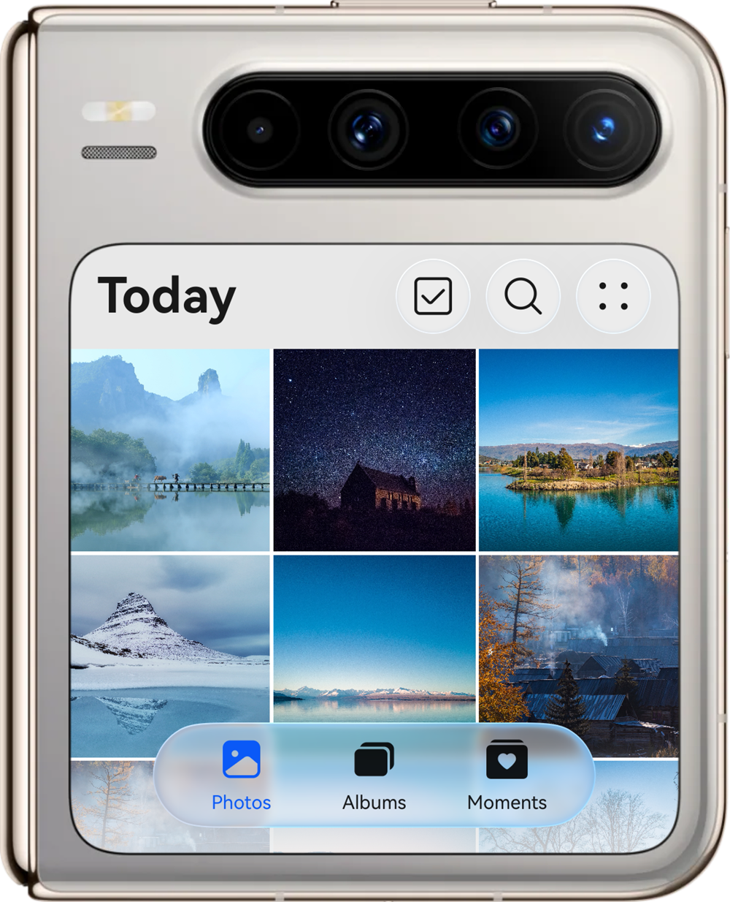
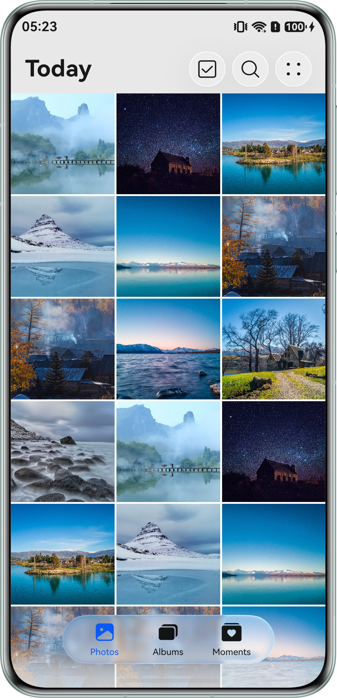
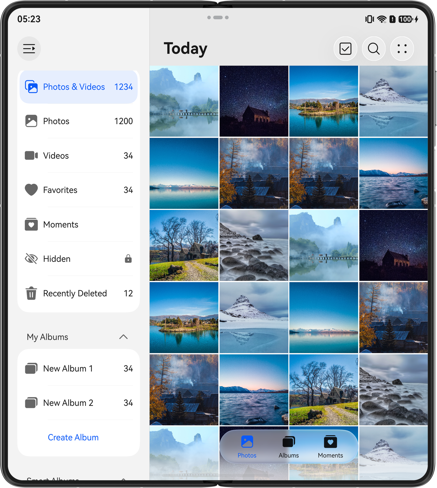
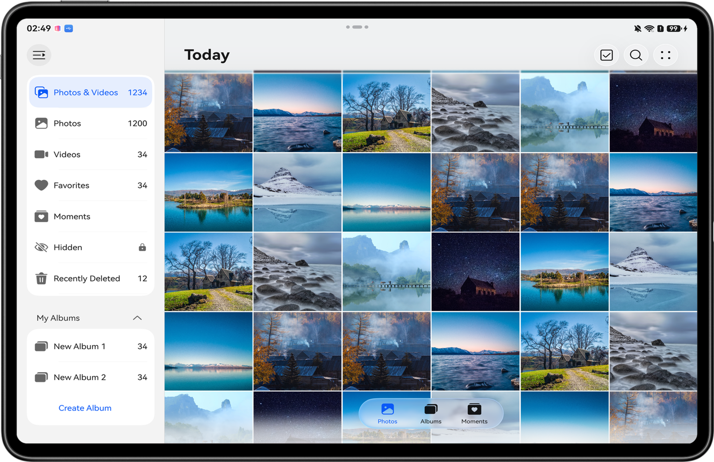
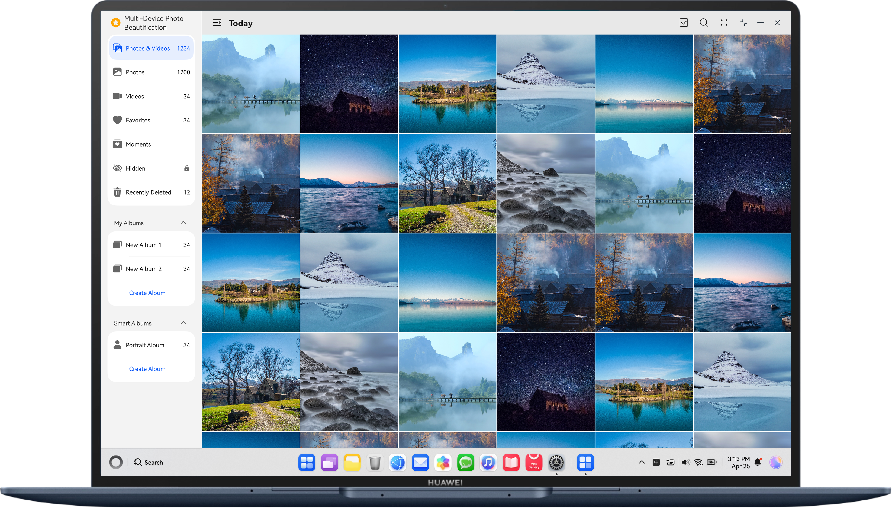

# Image Beautification

## Introduction

Learn to implement an image beautification app based on the adaptive layout and responsive layout, achieving one-time development for multi-device deployment.

## Description

This sample implements an image beautification app based on the adaptive layout and responsive layout, achieving one-time development for multi-device deployment. It uses the three-layer project architecture for code reuse and tailors the pages to different device sizes such as Bar phone, Bi-fold phone, Tablet, PC/2in1 devices.
The following figure shows the effect on the Bar phone.

## Preview

|                **purax external screen**                |                      **bar phone**                      |                       **bi-fold phone**                       |
|:-------------------------------------------------------:|:-------------------------------------------------------:|:-------------------------------------------------------------:|
|  |  |  |

|                        **tablet**                        |                        **pc**                        |
|:--------------------------------------------------------:|:----------------------------------------------------:|
|  |  |

## Concepts

- One-time development for multi-device deployment: It enables you to develop and release one set of project code for deployment on multiple devices as demanded. This feature enables you to efficiently develop applications that are compatible with multiple devices while providing distributed user experiences for cross-device transferring, migration, and collaboration.
- Area change event: It is triggered when the component's size, position, or any other attribute that may affect its display area changes.
- PinchGesture: It is used to trigger a pinch gesture, which requires two to five fingers with a minimum 5 vp distance between the fingers.

## 工程目录

```
├──features
│  ├──multipicturebrowsing/src/main
│  │  ├──ets
│  │  │  ├──constants                     // picture browsing constant class
│  │  │  ├──datasource                    // picture data source class
│  │  │  ├──model                         // picture browsing module model
│  │  │  ├──view                          // picture browsing module view
│  │  │  └──viewmodel                     // picture browsing module viewmodel
│  │  └──resources                        // resources
│  └──multipictureediting/src/main                
│     ├──ets
│     │  ├──constants                     // picture editing constant class
│     │  ├──model                         // picture editing module model
│     │  ├──view                          // picture editing module view
│     │  └──viewmodel                     // picture editing module viewmodel
│     └──resources                        // resources
├──multipicturecommon
│  └──base/src/main/ets
│     ├──constants                        // common constants
│     ├──utils                            // common utils
│     └──resources                        // resources
└──products
   ├──multipicturedefaultsample/src/main/ets
   │  ├──constants                        // constants
   │  ├──defaultability                   // program entry
   │  ├──defaultbackupability             // application data backup and recovery custom extension class
   │  ├──model                            // model
   │  ├──pages                            // entry page
   │  ├──view                             // view
   │  ├──viewmodel                        // viewmodel
   │  └──resources                        // resources
   └──multipicturepcsample/src/main/ets
      ├──constants                        // constants
      ├──defaultability                   // entry page
      ├──defaultbackupability             // Application data backup and recovery custom extension class
      ├──model                            // model
      ├──pages                            // entry page
      ├──view                             // view
      ├──viewmodel                        // viewmodel
      └──resources                        // resources
```

## 具体实现

* Implement the side navigation bar and page routing through the HdsNavigation component, and implement the bottom navigation bar and tab hovering style through HdsTabs.
* Change the columnsTemplate property of the Grid component according to different breakpoints to display images with different column counts on different devices; use the PinchGesture to implement a zoom gesture to modify the number of columns displayed for images.
* Utilize the colorFilter property of the Image component to apply different filters to the same image.

## Permissions

N/A.

## How to Use

- Install and open an app on a Bar phone, Wide-fold phone, Bi-fold phone, Tri-fold phone, Tablet, PC/2in1 device. The responsive layout and adaptive layout are used to display different effects on the app pages over different devices.
- Clicking the bottom tab or side navigation allows to switch between navigation pages or albums. Pinch with two fingers to zoom in or out on the grid to adjust the number of columns displayed.
- Clicking on the photo will take you to the picture editing page, and clicking on the filter will switch the filter effects.

## Constraints

1. The sample is only supported on Bar phones, Wide-fold phone, Bi-fold phone, Tri-fold phone, Tablet, PC/2in1 device with standard systems.
2. HarmonyOS: HarmonyOS 6.0.0 Release or later.
3. DevEco Studio: DevEco Studio 6.1.0 Release or later.
4. HarmonyOS SDK: HarmonyOS 6.1.0 Release SDK or later.
