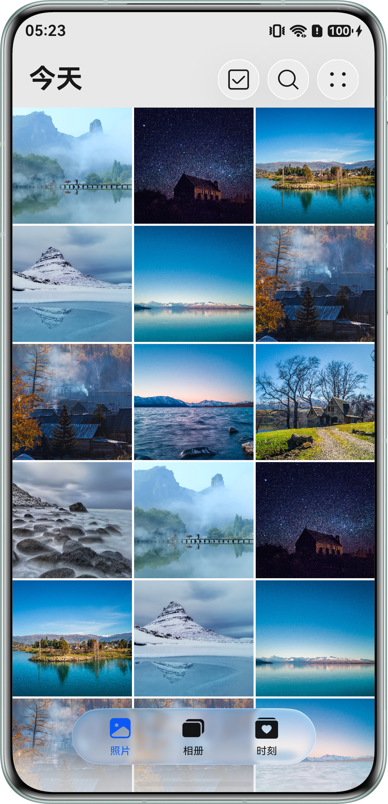
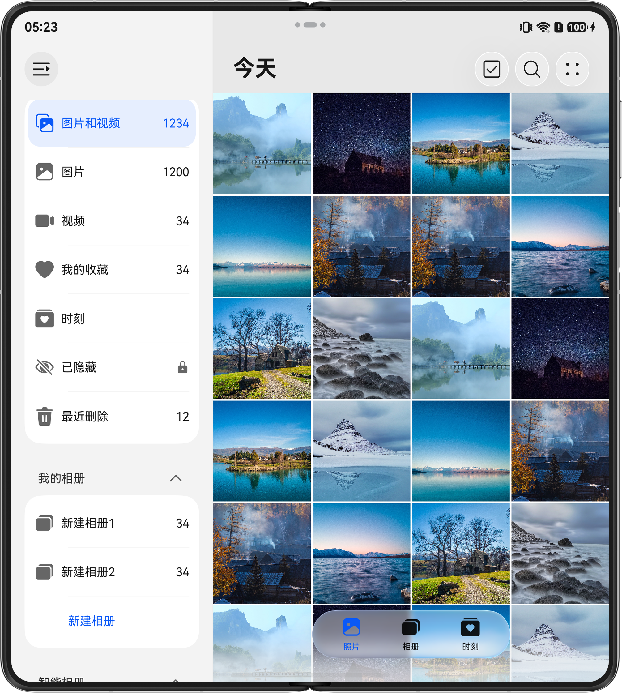
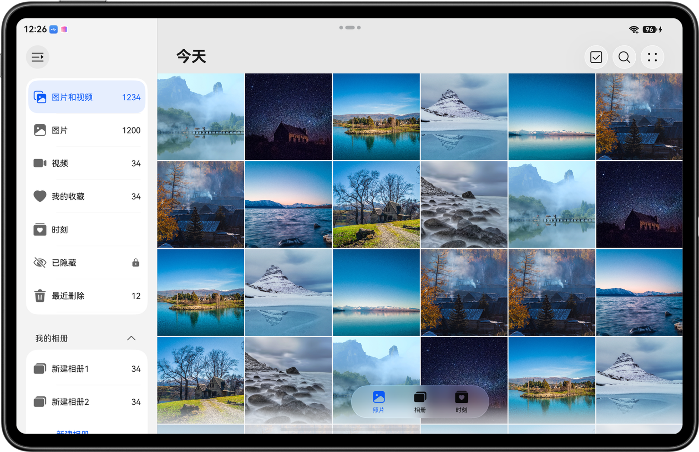
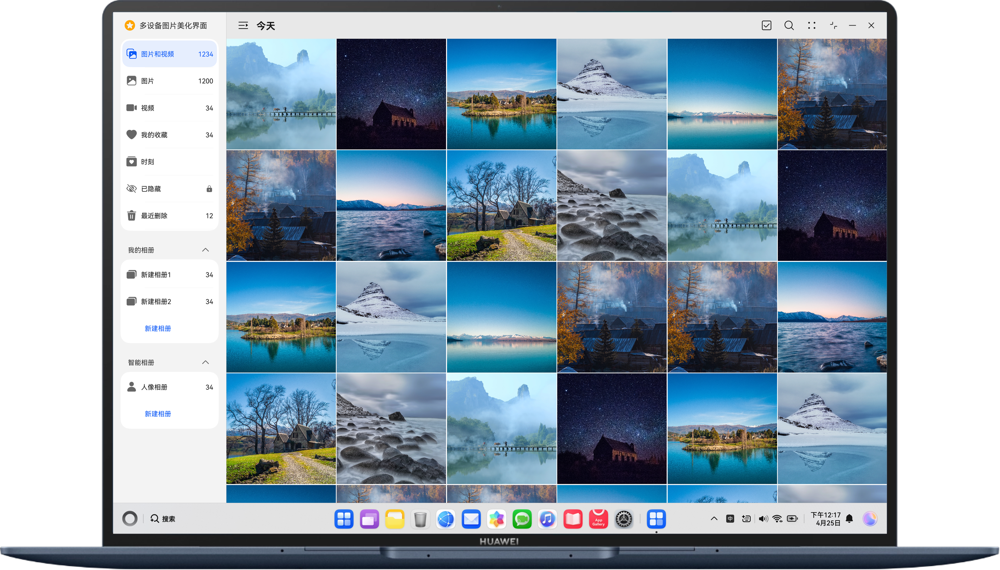

# 多设备图片美化界面

## 简介

基于自适应和响应式布局，实现一次开发，多端部署-图片美化。

## 介绍

本篇Sample基于自适应布局和响应式布局，实现一次开发，多端部署的图片美化页面。通过“三层工程架构”实现代码复用，并根据直板机、双折叠、平板、电脑等不同的设备尺寸设计对应页面。

## 效果图预览

|                      **purax外屏**                       |                        **直板机**                         |                            **双折叠**                            |
|:------------------------------------------------------:|:------------------------------------------------------:|:-------------------------------------------------------------:|
|  |  |  |

|                         **平板**                          |                       **电脑**                        |
|:-------------------------------------------------------:|:---------------------------------------------------:|
|  |  |

## 相关概念

- 一次开发，多端部署：一套代码工程，一次开发上架，多端按需部署。支撑开发者快速高效的开发支持多种终端设备形态的应用，实现对不同设备兼容的同时，提供跨设备的流转、迁移和协同的分布式体验。
- 组件区域变化事件：组件区域变化事件指组件显示的尺寸、位置等发生变化时触发的事件。
- 双指缩放：用于触发捏合手势，触发捏合手势的最少手指为2指，最大为5指，最小识别距离为5vp。

## 工程目录

```
├──features
│  ├──multipicturebrowsing/src/main
│  │  ├──ets
│  │  │  ├──constants                     // 照片浏览常量类
│  │  │  ├──datasource                    // 照片数据源类
│  │  │  ├──model                         // 照片浏览模块数据模型
│  │  │  ├──view                          // 照片浏览模块视图
│  │  │  └──viewmodel                     // 照片浏览模块视图模型
│  │  └──resources                        // 静态资源目录
│  └──multipictureediting/src/main                
│     ├──ets
│     │  ├──constants                     // 照片编辑常量类
│     │  ├──model                         // 照片编辑模块数据模型
│     │  ├──view                          // 照片编辑模块视图
│     │  └──viewmodel                     // 照片编辑模块视图模型
│     └──resources                        // 静态资源目录
├──multipicturecommon
│  └──base/src/main/ets
│     ├──constants                        // 公共常量
│     ├──utils                            // 公共工具
│     └──resources                        // 静态资源目录
└──products
   ├──multipicturedefaultsample/src/main/ets
   │  ├──constants                        // 常量类
   │  ├──defaultability                   // 程序入口
   │  ├──defaultbackupability             // 应用数据备份恢复自定义拓展类
   │  ├──model                            // 数据模型
   │  ├──pages                            // 入口页面
   │  ├──view                             // 视图
   │  ├──viewmodel                        // 视图模型
   │  └──resources                        // 静态资源目录
   └──multipicturepcsample/src/main/ets
      ├──constants                        // 常量类
      ├──defaultability                   // 程序入口
      ├──defaultbackupability             // 应用数据备份恢复自定义拓展类
      ├──model                            // 数据模型
      ├──pages                            // 入口页面
      ├──view                             // 视图
      ├──viewmodel                        // 视图模型
      └──resources                        // 静态资源目录
```

## 具体实现

* 通过HdsNavigation组件实现侧边导航栏与页面路由，通过HdsTabs实现底部导航栏以及页签的悬浮样式。
* 根据不同断点改变Grid组件的columnsTemplate属性，实现不同设备上显示不同列数的图片；通过PinchGesture实现缩放手势修改图片显示列数。
* 通过Image组件的colorFilter属性，实现同一张图片的不同滤镜。

## 相关权限

不涉及。

## 使用说明

- 分别在阔折叠、直板机、双折叠、三折叠、平板、电脑上安装并打开应用，不同设备的应用页面通过响应式布局和自适应布局呈现不同的效果。
- 点击底部导航或侧边导航能够切换导航页面或相册，双指缩放调整宫格显示列数。
- 点击照片将进入图片编辑页面，点击滤镜能够切换滤镜效果。

## 约束与限制

1. 本示例仅支持标准系统上运行，支持设备：直板机、双折叠、阔折叠、三折叠、平板、电脑。
2. HarmonyOS系统：HarmonyOS 6.0.2 Release及以上。
3. DevEco Studio版本：DevEco Studio 6.1.0 Release及以上。
4. HarmonyOS SDK版本：HarmonyOS 6.1.0 Release SDK及以上。